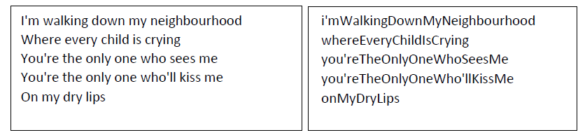

# CamelWriter Exercise

**Provided files:**

* `DryLips.txt`: Lyrics by Dúné
* `OhLand.txt`: Lyrics by Oh-Land
* `MaryAnn.t[DryLips.txt](DryLips.txt)xt`: Lyrics by Volbeat
* `CamelWriterExercise.CamelWriter.cs`: Code skeleton that can be used as a starting point
* `Program.cs` is also provided. Please take a look. You pass the name of the file from here.

**Objective**

In this assignment, you will develop a C# program that takes a text file as input and converts each line into a single word, written in camel script (`camelCase`: 
The first word starts with a lowercase letter, and subsequent words start with an uppercase letter (e.g., `myVariableName`)

* The first word in the line is written in lower case.
* Subsequent words' first letter are capitalized.
* The words are put together without spaces.

When a line is converted to a word in camel script, it is written to a text file.

**Example:**

**Hint:**

* Use a `StreamReader` to read the input file one line at a time.
* Split the line using the `space ' '` character to get an array of words.
* Convert the first word to lowercase and the first letter of the remaining words to uppercase.
* Concatenate the words to form a camel-cased word.
* Write the camel-cased word to a text file.

**Good luck!**