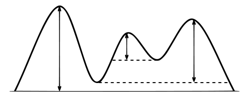

# Mountains
All hints referenced throughout the tasks, can be found at the end of the README.

## Tasks

*FrenchMountains.csv* is a semicolon-separated text file, where each line provides information about the mountains in France that have a *topographic prominence* taller than 1000 meters (*topographic prominence* is the relative height of a mountain top, see the figure, from *en.wikipedia.org*): 

In the file a Mountain is described with:

- `name` - The mountain’s name
- `height` - Height above the sea level
- `prominence` - Relative height (fig. 1)
- `latitude` - Latitude in Degree°Minutes’Seconds”
- `longitude` - Longitude in Degree°Minutes’Seconds”
- `range` - The mountain range

As an example, here is the line for *Mount Ventoux*:
> Mont Ventoux, h=1909, pro=1148, lat=44°10'26", lon=05°16'42", ran=Alps

In this task, the file must be read, and the information inserted into a data structure. The supplied code contains a `MountainDriver` class with a `Main()`-method that can be used to test the class.

### Example



- Vertical arrows show the topographic prominence of three peaks on an island. 
- The dashed horizontal lines show the lowest contours that do not encircle higher peaks.

### Task a - Creation of the Mountain Class

- Declare 6 instance variables to store the information about Mountain.
- Create a `get` property, to get the value of the `range`.
- Create a constructor to initialise these variables
- Implement the `public override string ToString()`, such that running the `Main()`-method of `MountainDriver` gives the following output: 
> Mont Ventoux h=1909, pro=1148, lat=44°10'26", lon=05°16'42", ran=Alps

### Task b - compareTo()-method

- Implement the `public int CompareTo(Mountain o)`, such that instances of `Mountain`, can be sorted by `prominence`. If several mountaintops have the same `prominence`, these should be sorted by `height`.
- Uncomment the code in the `Main()`-method of `MountainDriver` for Task b. The output should look as following:

```
Unsorted: 
Pic du Midi d'Ossau, h=2886, pro=1092, lat=42°48'22", lon=-00°25'05", ran=Pyrenees
Pica d'Estats, h=3143, pro=1281, lat=42°42'43", lon=00°57'23", ran=Pyrenees
Pic de Bure, h=2709, pro=1268, lat=44°37'38", lon=05°56'07", ran=Alps
Mont Chaberton, h=3131, pro=1281, lat=44°57'53", lon=06°45'06", ran=Alps

Sorted: 
Pic du Midi d'Ossau, h=2886, pro=1092, lat=42°48'22", lon=-00°25'05", ran=Pyrenees
Pic de Bure, h=2709, pro=1268, lat=44°37'38", lon=05°56'07", ran=Alps
Mont Chaberton, h=3131, pro=1281, lat=44°57'53", lon=06°45'06", ran=Alps
Pica d'Estats, h=3143, pro=1281, lat=42°42'43", lon=00°57'23", ran=Pyrenees
```

### Task c - Reading mountains from text file

Implement the remainder of the C# class `public class MountainSet`

The class must include:
- Declare an instance (meaning not static) variable of type `ISet<Mountain>` with the name **set*
- A constructor that instantiates the data structure so that it is always sorted using the `CompareTo()` method in the `Mountain` class.  ***(Hint 1)***
- Implement the `LoadMountains` method as following:
  - *Read FrenchMountains.csv* such that one line is read at a time (Remember that it is semicolon ';' seperated) ***(Hint 2)***
  - Create an instance of `Mountain` for each line read from FrenchMountain.csv, and insert the `Mountain` instance in the set using `set.Add()`
- Uncomment the `PrintMountains`-method.

Uncomment the code in the `Main()`-method of MountainDriver for Task c.
The first 7 lines of the print, should look like this:
```
[Puig Carlitte, h=2921, pro=1001, lat=42°33'39", lon=01°48'37", ran=Pyrenees
, Soularac, h=2368, pro=1007, lat=42°45'58", lon=01°51'05", ran=Pyrenees
, Pic de Rochebrune, h=3320, pro=1019, lat=44°49'21", lon=06°47'16", ran=Alps
, Le Tabor, h=2389, pro=1022, lat=44°58'39", lon=05°51'21", ran=Alps
, Vignemale, h=3298, pro=1025, lat=42°42'16, lon=-00°03'50", ran=Pyrenees
, Le Roignais, h=2995, pro=1028, lat=45°38'35", lon=06°41'20", ran=Alps
, Montagne de Céüse, h=2016, pro=1040, lat=44°30'32", lon=05°57'43", ran=Alps
```

### Task d - Sorted Set with Comparer

- Create a class called `MountainRangeComparer` that implements the `IComparer` interface **_(Hint 3)_**
- Implement the `Compare()` method to compare two `Mountain` objects by their range values 
  - If the two objects have the same range, they should be compared by their prominence values **_(Hint 4)_**
    - If the two objects have the same prominence, they should be compared by their height values. **_(Hint 4)_**


- Add the following method to the MountainSet class: 

  ```csharp
  public ISet<Mountain> SortByRange(IComparer<Mountain> comparer);
  ```

  1. Create an instance of `SortedSet` and pass `Compararer` object as an argument in its constructor **_(Hint 5)_**
  2. Add the `ISet<Mountain> set` to the set created above **_(Hint 6)_**
  3. Return a `ISet<Mountain> rangeSet` which is sorted by an instance of `MountainRangeComparer`.

Uncomment the code in the Main()-method of MountainDriver for Task c. You should get the following output:
```
Sorted by range:
[Pic de Rochebrune, h=3320, pro=1019, lat=44°49'21", lon=06°47'16", ran=Alps
, Le Tabor, h=2389, pro=1022, lat=44°58'39", lon=05°51'21", ran=Alps
, Le Roignais, h=2995, pro=1028, lat=45°38'35", lon=06°41'20", ran=Alps
, Montagne de Céüse, h=2016, pro=1040, lat=44°30'32", lon=05°57'43", ran=Alps
, Grand Pic de Belledonne, h=2978, pro=1054, lat=45°10'09", lon=05°59'22", ran=Alps

- - - etc. - - - 
```

And end with the remaining mountain ranges:

```
- - - etc. - - - 
, Crêt de la Neige, h=1720, pro=1267, lat=46°16'49", lon=05°57'16", ran=Jura
, Puy de Sancy, h=1885, pro=1575, lat=45°31'42", lon=02°48'51", ran=Massif Central
, Puig Carlitte, h=2921, pro=1001, lat=42°33'39", lon=01°48'37", ran=Pyrenees
, Soularac, h=2368, pro=1007, lat=42°45'58", lon=01°51'05", ran=Pyrenees
, Vignemale, h=3298, pro=1025, lat=42°42'16, lon=-00°03'50", ran=Pyrenees
, Pic du Midi d'Ossau, h=2886, pro=1092, lat=42°48'22", lon=-00°25'05", ran=Pyrenees
, Pica d'Estats, h=3143, pro=1281, lat=42°42'43", lon=00°57'23", ran=Pyrenees
, Puigmal, h=2909, pro=1331, lat=42°29'47", lon=02°05'37", ran=Pyrenees
, Grand Ballon, h=1424, pro=1072, lat=47°54'04", lon=07°05'53", ran=Vosges ]
```

## Hints

**Hint 1**:  Use `SortedSet<Mountain>()`


**Hint 2**: Use the `.Split(";")` on the string outputted from the `sr.ReadLine()` to get the array of values 


**Hint 3**: `public class MountainRangeComparer : IComparer<Mountain>` 


**Hint 4**: Use `CompareTo()`-method in Mountain. *Remember* *to add a* `get` property for `range` *to the* `Mountain` *class, to be used in the `Compare()` method)*


**Hint 5**: `ISet<Mountain> rangeSet = new SortedSet<Mountain>(comp);`


**Hint 6**: Use `rangeSet.UnionWith(set)`
