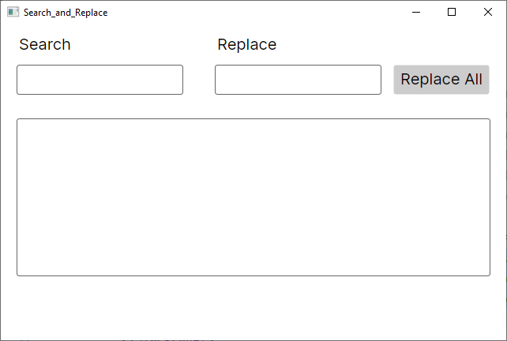
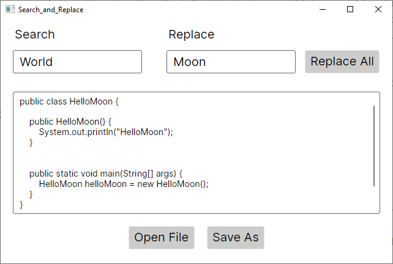

# Search And Replace
## Task 1 - GUI
You will be working with the following file(s) for this exercise: **MainWindow.axaml, MainWindow.axaml.cs**

**Purpose:** Using Avalonia to create a GUI application with search and replace functionality.

1. Add the following components to your scene:

   - A `Label` and a `TextBox` for the text you will be searching for.
   - A `Label` and a `TextBox` for the text you will be replacing it with.
   - A `TextBox` for showcasing the text you will be search-and-replacing in.
   - A `Button` for implementing the _Replace All_ functionality.

2. Program a Handler for the button, so every occurrence of the text in the _"search"-field_ will be replaced by the text in the _"replace"-field_

Your stage should look like this at the end of Task 1

## Task 2 - Simple File-I/O

**Purpose:** To be able to load the text you wish to use the search-and-replace functionality from a file and saving the altered text in another file.

**Hint:** It is _**strongly**_ recommended to look at the Avalonia documentation on how to use File Dialogs. https://docs.avaloniaui.net/docs/basics/user-interface/file-dialogs

You will be working with the following file(s) for this assignment: **MainWindow.axaml, MainWindow.axaml.cs, HelloWorld.txt**

1. Add 2 buttons to your scene, _"Open file"_ and _"Save as"_.
2. Create a Handler for the _"Open file"_-button which uses the `StorageProvider.OpenFilePickerAsync()`, to select the desired file. Read the content of the inFile and load into the `TextBox`.
3. Create a Handler for the _"Save as"_-button, which uses the `StorageProvider.SaveFilePickerAsync()`, to save a file. The content of the `TextBox` should be written in the output file.

Example of the final stage visible below:

In this example _"HelloWorld.txt"_ has been loaded. (found in the root of the project folder), all occurrences of the word _"World"_ has been changed to _"Moon"_ and the result has been saved to _"HelloMoon.txt"_.
