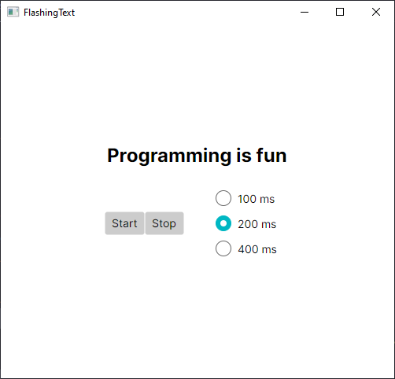

x## Animation Control

In this exercise, you need to implement the action handlers for start, stop, and radio buttons for controlling an animation.
### Task 1 -  Design GUI: `MainWindow.axaml`
* Design GUI as given below.
  * 1 Label for the text *(It should be empty initially)*
  * 2 Buttons: Start and Stop
  * 3 Radio Buttons
* Create and attach handlers to the Start Button, Stop Button and the Radio Buttons. The radio button should share the same handler.
* Assign each radio button to the same group to ensure only one selection at a time.

### Task 2 - Implement handlers in `MainWindow.axaml.cs`
The following variables `text`, `thread` and `waitTime` are already declared in `MainWindow.axaml.cs`. Please take a look.
### Task 2.1 - Implement a `StartButton` ActionHandler
* Initialize the `thread` variable and pass the `ChangeLabel()` method to this Thread
* Make this thread a background thread.
* Start the thread's execution.

### Task 2.2 - Implement a `StopButton` ActionHandler
* Stop the animation by interrupting the `thread` started in `StartHandler`.

### Task 2.3 - Implement a `RadioButtons` ActionHandler
* Figure out which radio button is selected. _(**Hint**: You can use the `sender` variable from the handler)_
  * When a radio button is selected, the handler retrieves the corresponding sleep time value.
  * The variable `waitTime` is updated with the new value.

### Task 2.4 - Implement `ChangeLabel()` method
* Enclose the main logic of the method within a `try-catch` block to handle `ThreadInterruptedException`.
* In the catch block, print "Interrupted" to the console. 
* Create an infinite `while (true)` loop to continuously toggle/animate the label content. 
* Create an empty string variable named `currentContent`.
* Use `Dispatcher.UIThread.InvokeAsync().Wait()` to safely access and retrieve the current content of `Label` from the UI thread and to ensure the UI thread operation completes before continuing.
* Store the content in the `currentContent` variable.
* Check if `currentContent` is empty.
    * If it's empty, set the string variable named `text` to "Programming is fun".
    * Otherwise, set `text` to an empty string. 
* Write the value of text to the console. 
* Use `Dispatcher.UIThread.InvokeAsync().Wait` to safely update the `Label` content with the value of `text` on the UI thread and to ensure the UI thread operation completes. 
* Use `Thread.Sleep(waitTime)` to pause the thread for the specified duration.